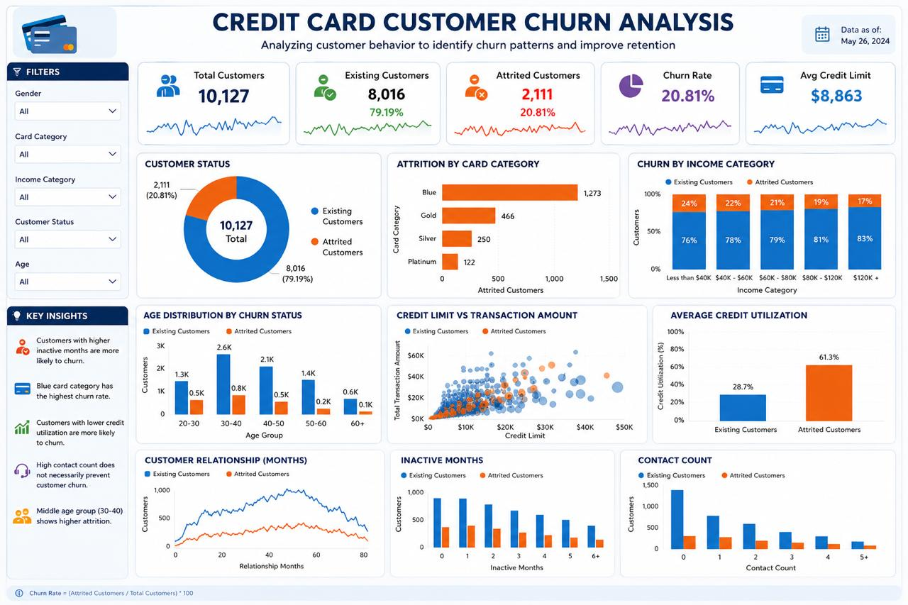
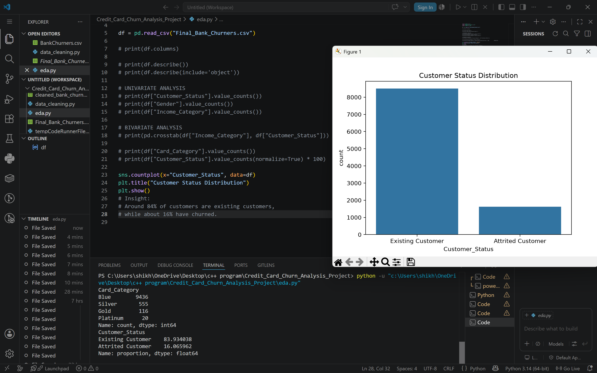
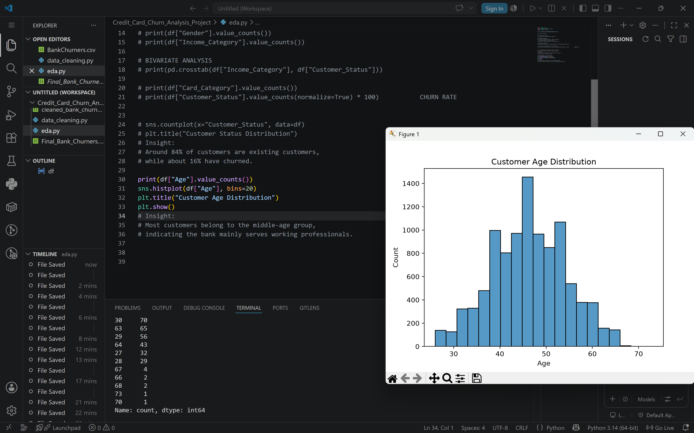
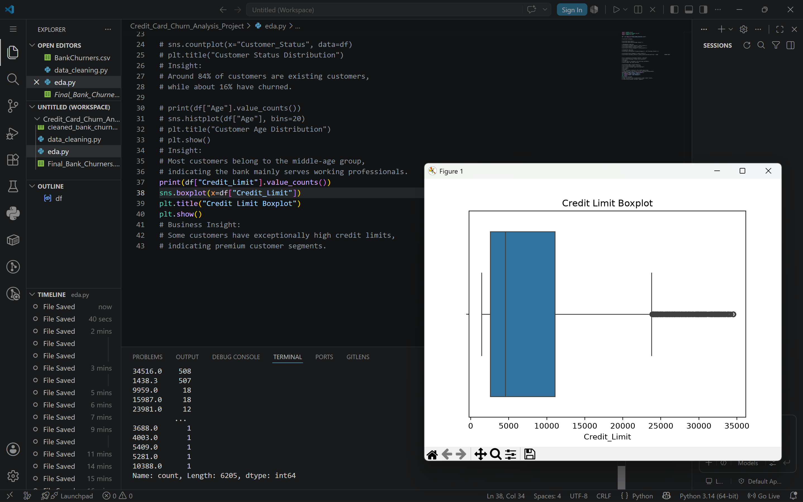
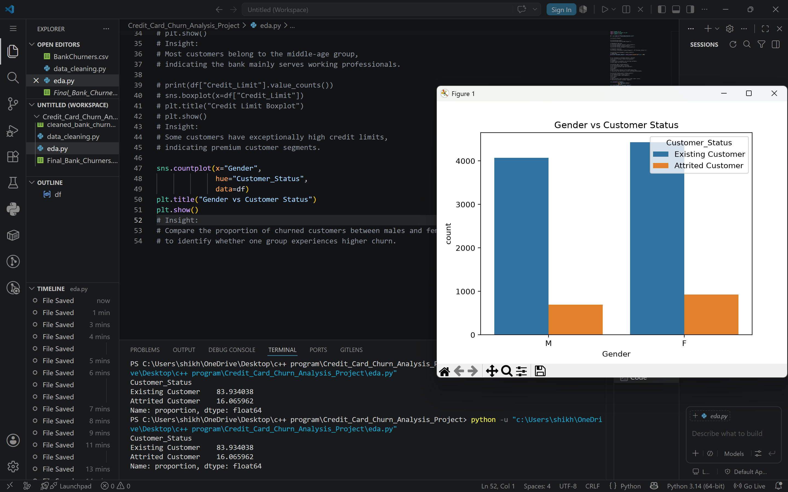

# 💳 Credit Card Churn Analysis

## 📌 Project Overview

This project analyzes customer churn in the banking sector using **Python, SQL, Excel, Pandas, Matplotlib, and Seaborn**.

The objective is to understand customer behavior, identify factors influencing churn, and generate meaningful business insights through Exploratory Data Analysis (EDA).

Unlike a machine learning project, this project focuses on the complete **data analysis workflow**, including data cleaning, SQL feature engineering, visualization, and business insight generation.

---

# 🎯 Objectives

- Inspect and understand the customer dataset.
- Clean and preprocess banking customer data.
- Create new business-related features using SQL.
- Perform Exploratory Data Analysis (EDA).
- Visualize customer behavior and churn patterns.
- Generate actionable business insights.

---

# 🛠️ Technologies Used

- Python
- Pandas
- Matplotlib
- Seaborn
- SQL (MySQL)
- Microsoft Excel
- VS Code
- Git
- GitHub

---

# 📂 Project Workflow

## Step 1 — Dataset Inspection (Excel)

- Inspected the BankChurners dataset.
- Reviewed columns, data types, and overall structure.
- Performed initial data validation.

---

## Step 2 — Data Cleaning (Python - Pandas)

Performed data preprocessing using Pandas:

- Checked missing values
- Verified duplicate records
- Inspected data consistency
- Prepared a cleaned dataset

**Output**

`cleaned_bank_churners.csv`

---

## Step 3 — Feature Engineering (SQL)

Used SQL JOIN operations to enrich the dataset by adding two new business-related columns:

- Reward Rate
- Annual Fees

Created the final transformed dataset.

**Output**

`Final_Bank_Churners.csv`

---

## Step 4 — Exploratory Data Analysis (EDA)

Performed both **Univariate** and **Bivariate Analysis** using:

- Pandas
- Matplotlib
- Seaborn

Generated various visualizations including:

- Count Plots
- Bar Charts
- Box Plots
- Histograms
- Distribution Plots
- Correlation Analysis

---

# 📊 Dashboard

---

## 📊 Visualizations

### Customer Status Distribution

---

### Customer Age Distribution

---

### Credit Limit Distribution

---

### Gender vs Customer Status

# 📈 Key Insights

- Approximately **84%** of customers are existing customers.
- Around **16%** of customers have churned.
- Churn varies across different card categories.
- Customer demographics influence churn behavior.
- Credit limit distribution highlights the presence of high-value customers.
- Reward Rate and Annual Fees were added using SQL joins to enrich the dataset for better business analysis.

---

# 💼 Skills Demonstrated

- Data Cleaning
- Data Preprocessing
- Feature Engineering
- SQL JOIN Operations
- Exploratory Data Analysis (EDA)
- Data Visualization
- Business Insight Generation
- Python Programming
- Git & GitHub

---

# 🚀 Future Improvements

- Develop a Machine Learning model for churn prediction.
- Compare multiple classification algorithms.
- Build an interactive dashboard using Power BI or Streamlit.
- Deploy the project as a web application.

---

# 👨‍💻 Author

**Vanshdeep Sharma**

Aspiring Data Analyst

### Technical Skills

Python • SQL • Pandas • Matplotlib • Seaborn • Excel • Data Analysis • Git • GitHub
